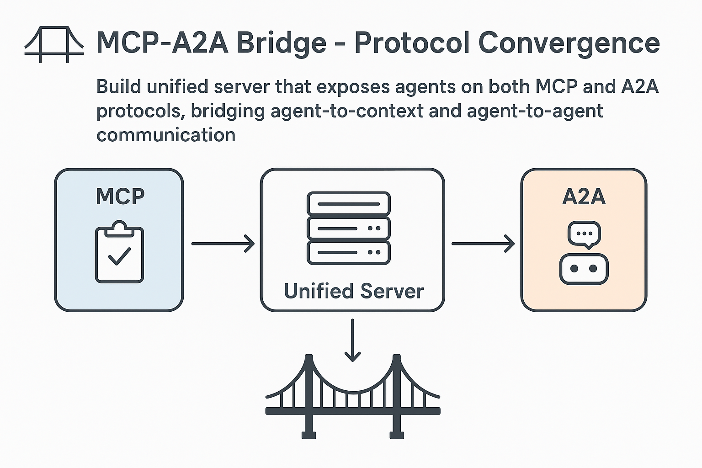

# MCP-A2A Bridge - Protocol Convergence 🌉

**Build unified server that exposes agents on both MCP and A2A protocols, bridging agent-to-context and agent-to-agent communication**



> **🎯 Learning Objective**: Master the integration of Model Context Protocol (MCP) and Agent-to-Agent (A2A) protocols in a single agent architecture, enabling seamless context management and agent collaboration.

## 🧠 Learning Sciences Foundation

### **Protocol Integration Learning**
- **Unified Interface Design**: Creating consistent APIs across different protocol paradigms
- **Context-Agent Bridge Patterns**: Connecting agent-to-context with agent-to-agent workflows
- **Architectural Convergence**: Understanding when and how to combine complementary protocols

### **Cognitive Load Management**
- **Single Agent, Dual Protocols**: Reducing complexity through unified implementation
- **Protocol Translation**: Converting between MCP context operations and A2A agent messages
- **Seamless User Experience**: Hiding protocol complexity behind intuitive interfaces

## 📋 Prerequisites

✅ **Knowledge**: MCP protocol fundamentals and A2A agent implementation  
✅ **Understanding**: Context management vs agent collaboration patterns  
✅ **Tools**: UV package manager, Python 3.10+, MCP SDK, A2A libraries  

## 🚀 MCP A2A Agents Implementation

In this step, you'll build a unified FastAPI server that exposes agents via both MCP and A2A protocols. The Finance Assistant (exposed via A2A) will use the Exchange Officer (exposed as a tool via MCP) to fetch real-time data, demonstrating protocol bridging. Since students are already familiar with MCP, we'll focus on the integration aspects with A2A.

### Key Files:
1. **finance_assistant.py**: The Finance Agent responsible for all Finance Management and Financial Education of a user. This agent handles user queries related to personal finance and uses tools for data retrieval.
2. **exchange_officer.py**: An Exchange Agentic System that runs an Online Exchange. This agent provides functionalities like fetching current cryptocurrency rates (e.g., ETH).
3. **mcp_server.py**: Defines the MCP endpoints to expose the Exchange Officer as a tool for context management.
4. **a2a_server.py**: Defines the A2A endpoints to expose the Finance Assistant for interaction with other agents, and integrates the MCP-exposed Exchange Officer as a tool.
5. **unified_server.py**: The main FastAPI application that mounts both MCP and A2A servers (using APIRouters or sub-applications) to run everything on a single server.

### Scenario Demonstration:
- A user asks their Personal Finance Agent (via the A2A server) for the current ETH rate.
- The Finance Agent calls a tool, which is essentially the MCP server exposing the Exchange Officer Agent.
- All components run on the same unified FastAPI server, showcasing seamless interoperability.

### Concepts Demonstrated:
- The same agent can be exposed on both protocols.
- An agent running on one protocol (e.g., Finance Agent on A2A) can interact with agents running on another protocol (e.g., Exchange Officer via MCP).

### Setup and Running:
1. Install dependencies using UV: `uv sync` 
2. Run the unified server: `uv run main.py`.
3. Test the A2A endpoint to query the Finance Assistant (e.g., via curl or a client agent). `uv run test_main.py`.
4. Observe the logs to see the A2A-to-MCP bridge in action when fetching the ETH rate.

### Code Highlights:
To mount both servers in `unified_server.py`:

```python
from fastapi import FastAPI
from mcp_server import mcp_app 
from a2a_server import a2a_app

app = FastAPI(title="MCP-A2A Unified Bridge")

app.mount("/mcp", mcp_app)
app.mount("/a2a", a2a_app)

# Additional middleware or configs if needed for protocol translation
```

This setup hides the protocol differences, allowing the A2A agent to treat MCP tools as native.

## 📖 Learning Resources

### **Primary Resources**
- [MCP Protocol Specification](https://spec.modelcontextprotocol.io/)
- [A2A Protocol Bridge Patterns](https://google-a2a.github.io/A2A/latest/topics/integration/)
- [FastAPI Documentation on Mounting Sub-Applications](https://fastapi.tiangolo.com/advanced/sub-applications/)

### **Additional Reading**
- Anthropic's MCP Introduction: For a refresher on MCP basics.
- Google's A2A Announcement: To understand A2A's role in agent interoperability.

---
**Remember**: The bridge you build here represents the evolution of AI agent architecture - where context management and agent collaboration converge into powerful, unified systems! 🌉